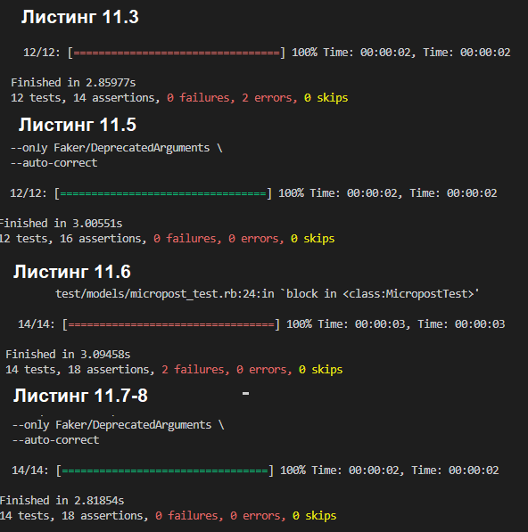
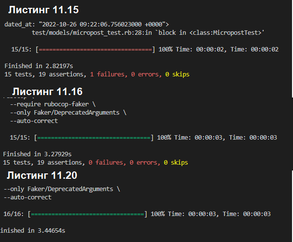
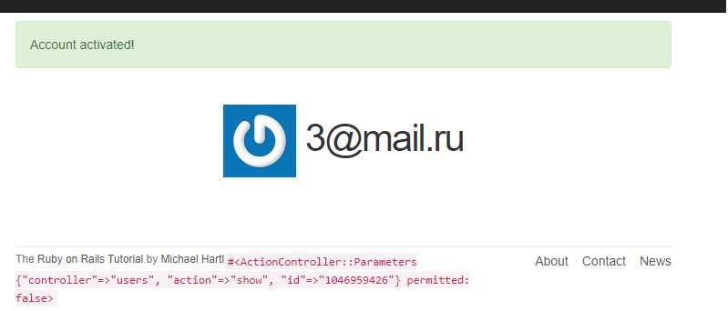
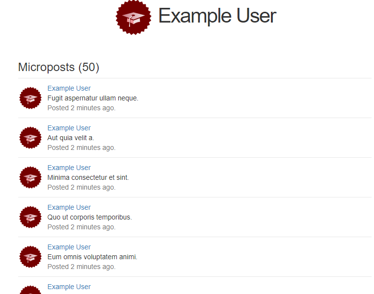
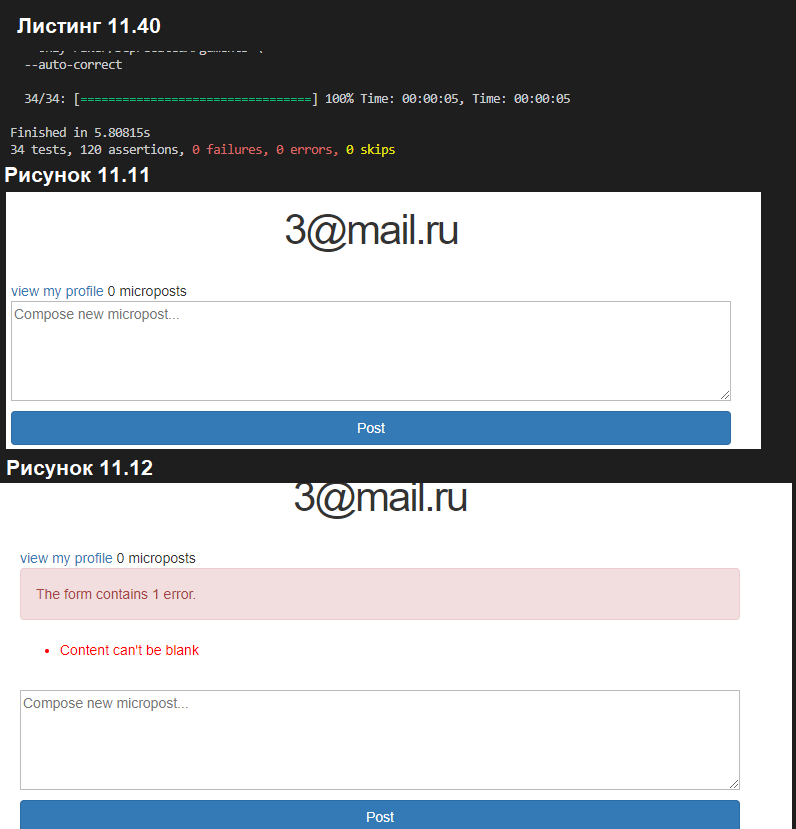
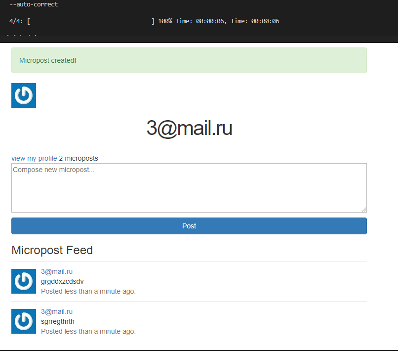
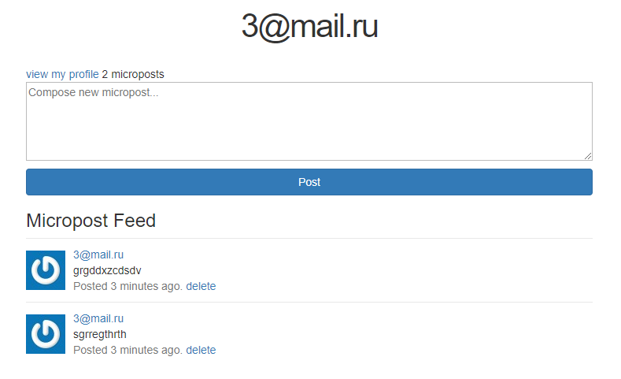
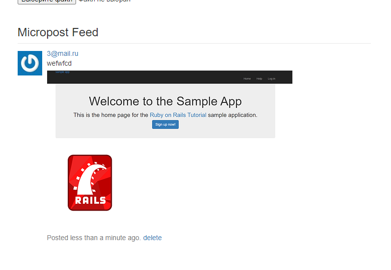

# Ruby-on-rails-labs-
# Лабораторные работы на языке Ruby

## Глава 11

## 11.1 Модель Micropost

### 11.1.2 Валидации микросообщений

### 11.1.4 Усовершенствование микросообщений

## 11.2 Отображение микросообщений
### 11.2.1 Рендеринг (визуализация) микросообщений

### 11.2.2 Образцы микросообщений

### 11.2.3 Тесты профиля с микросообщениями

## 11.3 Манипулирование микросообщениями

### 11.3.2 Создание микросообщений

### 11.3.3 Прото-лента сообщений

### 11.3.4 Уничтожение микросообщений

## 11.4 Изображения в микросообщениях

### 11.4.1 Базовая загрузка изображений

