# Ruby-on-rails-labs-
# Лабораторные работы на языке Ruby
## Глава 1(Папка: hello_app)

для переключения на вторую лабу необходимо в файле routes.rb раскоментировать строку 7 и закоментировать строку 8

## Глава 2(Папка: hello_app)

для переключения на вторую лабу необходимо в файле routes.rb раскоментировать строку 8 и закоментировать строку 7

## Глава 3(Папка: sample_app)

### **Представление всех страниц**

### Тесты
#### **3.3.1** 

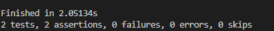

#### **3.3.2**
в тестах есть проверка на страницу about, которая отсутствует

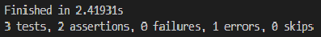

#### **3.3.3 Добавляем about**

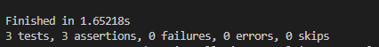

#### **3.4.1 Тестирование заголовков(нет заголовков)**

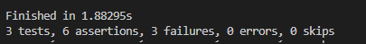

#### **3.4.2 Тестирование заголовков(есть заголовки)**

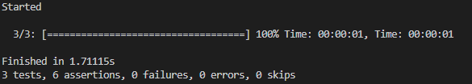

#### **3.6. Упражнения**
(Используя специальную функцию setup, которая автоматически запускается перед каждым тестом, убедитесь, что тест из Листинга 3.38 всё такой же ЗЕЛЕНЫЙ)

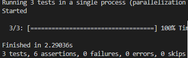

#### **3.7.1 minitest reporters**
(Используя специальную функцию setup, которая автоматически запускается перед каждым тестом, убедитесь, что тест из Листинга 3.38 всё такой же ЗЕЛЕНЫЙ)

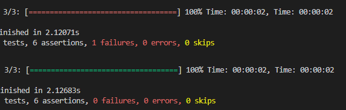

## Глава 4(Папка: sample_app)

#### **4.5 and 4.6**

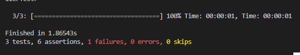

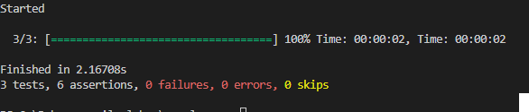

### **Rails console**(Упражнение)
4.14

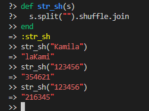

4.25

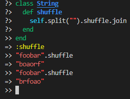

## Глава 5(Папка: sample_app)

### Листинг.5.4.Добавление gem bootstrap

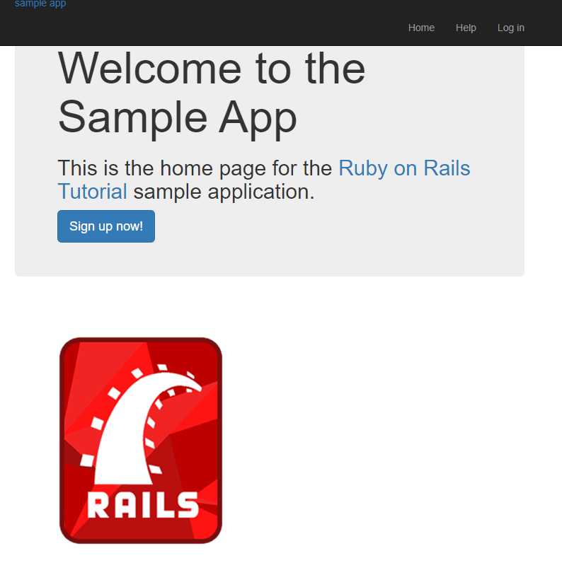

### Листинг.5.5.Добавление стилей css

### Листинг.5.6.Добавление стилей css для притятного оформления

### Листинг.5.7.Добавление стилей css для логотипа сайта

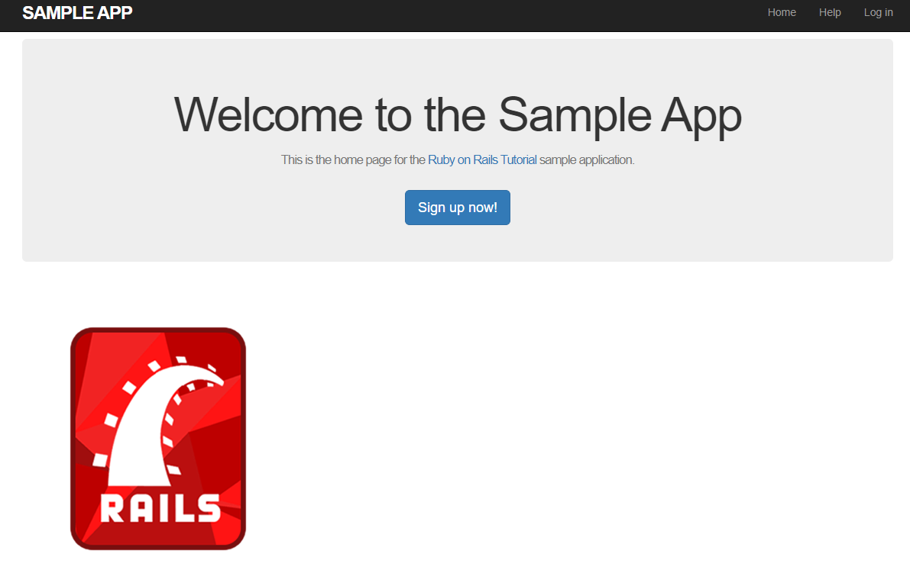

### 5.1.3 Частичные шаблоны (партиалы)

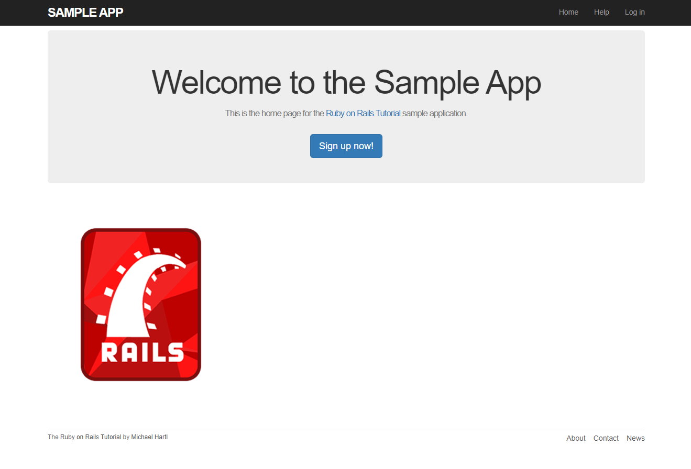

### 5.3.3 Использование именованных маршрутов

### 5.3.4 Тесты ссылок макета

### **5.4 Регистрация пользователей: первый шаг**

### 5.4.1 Контроллер Users

#### Листинг 5.29: ЗЕЛЕНЫЙ

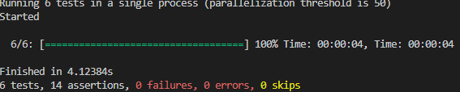

#### Листинг 5.35: Начальная страница регистрации (заглушка).

## Глава 6(Папка: sample_app)

#### 6.1.3 Создание объектов user

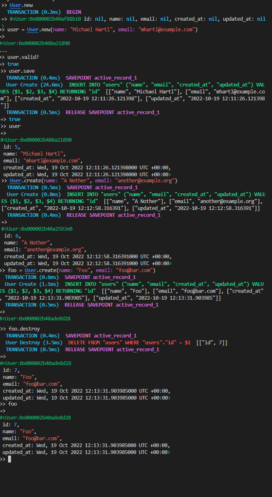

#### 6.1.5 Обновление объектов user

### 6.2 Валидации User

#### 6.2.1 Тесты валидности

#### 6.2.2 Валидация наличия

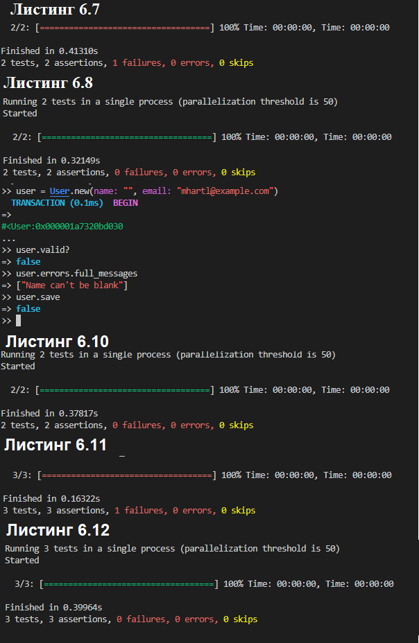

#### 6.2.2 Валидация наличия

#### 6.2.3 Валидация длины

#### 6.2.4 Валидация формата

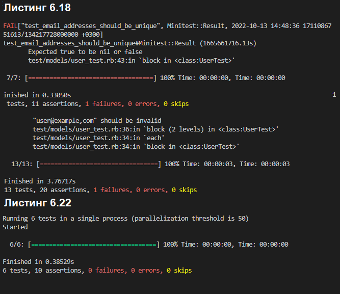

#### 6.2.5 Валидация уникальности

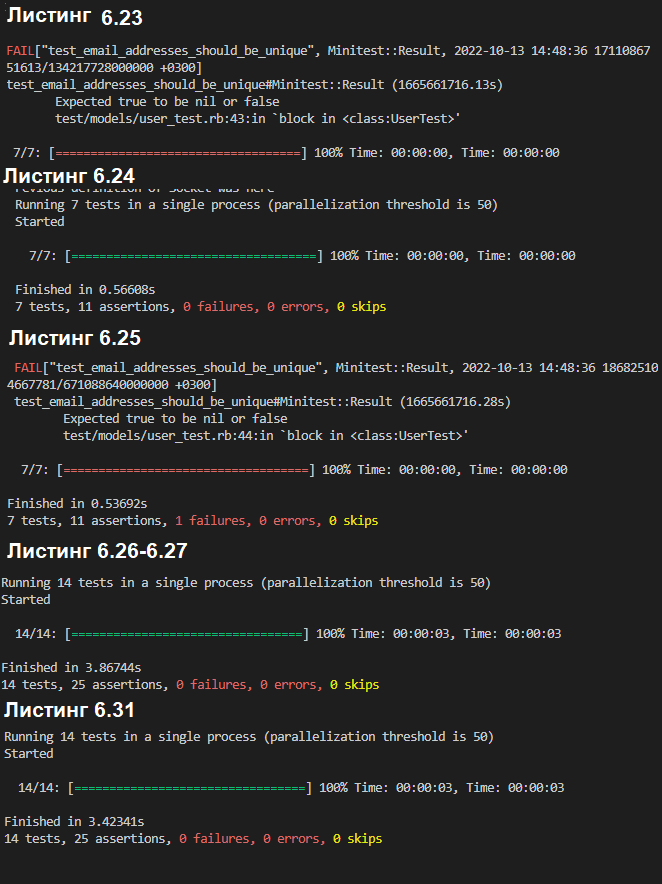

### 6.3 Добавление безопасного пароля

#### 6.3.2 Пользователь has secure password

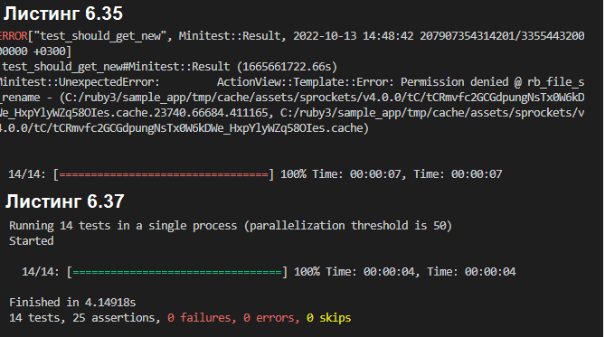

#### 6.3.3 Минимальные стандарты паролей

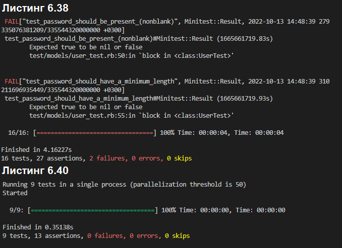

#### Упражнение

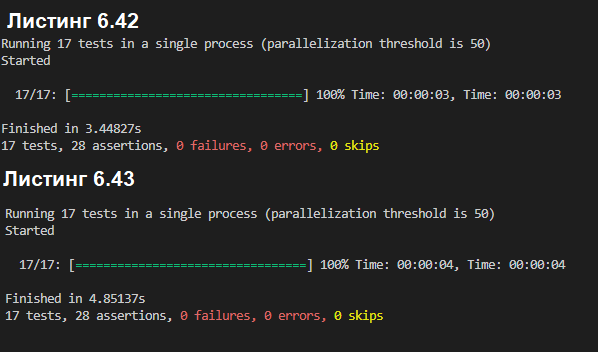

## Глава 7(Папка: sample_app)
