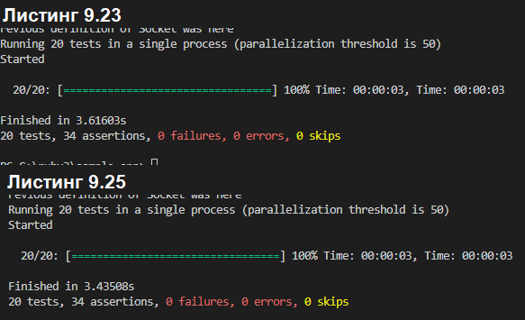

# Ruby-on-rails-labs-
# Лабораторные работы на языке Ruby

## Глава 9

## 9.1 Обновление пользователей

### 9.1.1 Форма редактирования

### 9.1.2 Провальное редактирование

### 9.1.4 Успешное редактирование (с TDD)

## 9.2 Авторизация
### 9.2.1 Требование входа пользователей

### 9.2.2 Требование правильного пользователя

### 9.2.3 Дружелюбная переадресация

## 9.3 Отображение всех пользователей
### 9.3.1 Список пользователей

### 9.3.2 Образцы пользователей

### 9.3.3 Пагинация

### 9.3.4 Тесты списка пользователей

### 9.3.5 Частичный рефакторинг

## 9.4 Удаление пользователей

### 9.4.2 Действие destroy

### 9.4.3 Тесты удаления пользователя

