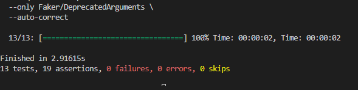

# Ruby-on-rails-labs-
# Лабораторные работы на языке Ruby

## Глава 12

## 12.1 Модель Relationship
### 12.1.3 Валидации взаимоотношений

### 12.1.4 Читаемые пользователи

### 12.1.5 Читатели

## 12.2 Веб-интерфейс следования за пользователями
### 12.2.2 Статистика и форма для следования

### 12.2.3 Страницы читаемых и читателей

### 12.2.4 Стандартный способ реализации кнопки “Читать”

