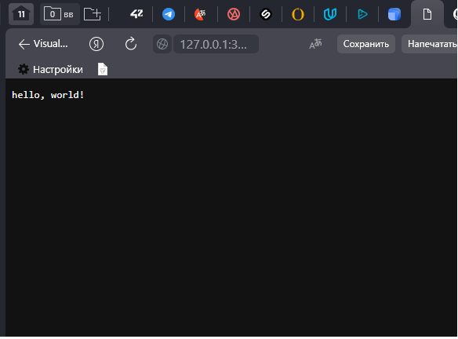
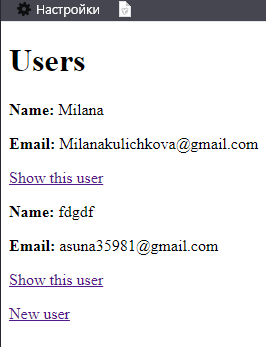

# Ruby-on-rails-labs-
# Лабораторные работы на языке Ruby
## Глава 1(Папка: hello_app)

для переключения на вторую лабу необходимо в файле routes.rb раскоментировать строку 7 и закоментировать строку 8

## Глава 2(Папка: hello_app)

для переключения на вторую лабу необходимо в файле routes.rb раскоментировать строку 8 и закоментировать строку 7

## Глава 3(Папка: sample_app)

### **Представление всех страниц**

### Тесты
#### **3.3.1** 

#### **3.3.2**
в тестах есть проверка на страницу about, которая отсутствует

#### **3.3.3 Добавляем about**

#### **3.4.1 Тестирование заголовков(нет заголовков)**

#### **3.4.2 Тестирование заголовков(есть заголовки)**

#### **3.6. Упражнения**
(Используя специальную функцию setup, которая автоматически запускается перед каждым тестом, убедитесь, что тест из Листинга 3.38 всё такой же ЗЕЛЕНЫЙ)

#### **3.7.1 minitest reporters**
(Используя специальную функцию setup, которая автоматически запускается перед каждым тестом, убедитесь, что тест из Листинга 3.38 всё такой же ЗЕЛЕНЫЙ)

## Глава 4(Папка: sample_app)

#### **4.5 and 4.6**

### **Rails console**(Упражнение)
4.14

4.25

## Глава 5(Папка: sample_app)

